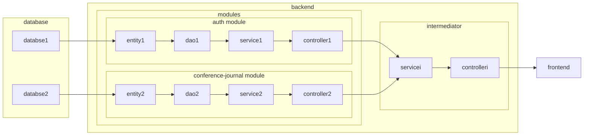
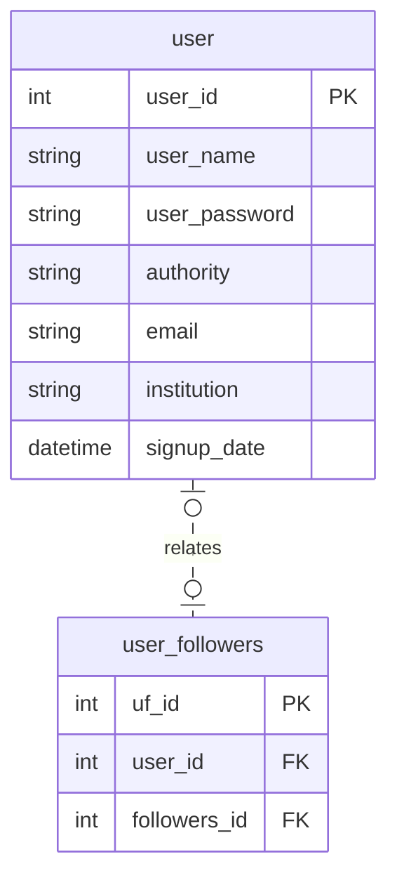
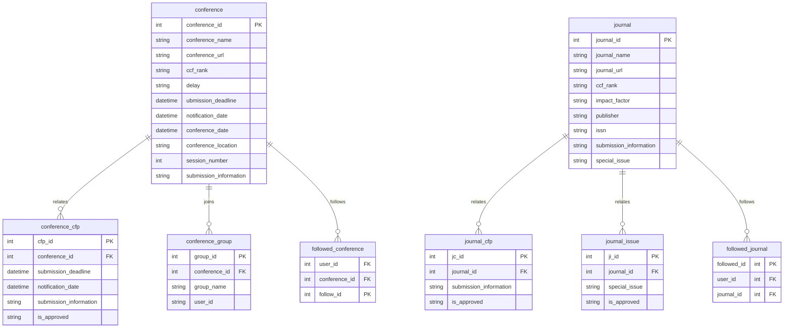

# 设计文档

## 目录

- [设计文档](#设计文档)
  - [目录](#目录)
  - [项目技术选型](#项目技术选型)
  - [项目结构](#项目结构)
  - [项目开发环境](#项目开发环境)
  - [项目架构设计](#项目架构设计)
    - [系统架构图](#系统架构图)
    - [系统调用顺序图](#系统调用顺序图)
  - [数据库ER图](#数据库er图)
    - [鉴权模块](#鉴权模块)
    - [会议期刊模块](#会议期刊模块)

## 项目技术选型

- Java 17
- Spring Boot 3.0.3
- Spring Cloud 微服务架构
- MySQL 8.0.32

## 项目结构

- 系统类：
  - eureka: 该文件夹内为Spring cloud所需的Eureka组件，用于项目内各个子模块的注册。
  - common-utils: 各个子模块共享的工具模块。
- 功能模块：
  - auth: 登陆鉴权模块。
  - conference-journal: 会议与期刊管理模块。
  - intermediator: 中间层模块，负责处理并转发数据。
- 其他：
  - database: 用于prod环境初始化数据库与插入数据的sql文件。
  - docs: 项目文档。

## 项目开发环境

- dev: 开发环境，每次项目启动时重置数据库。
- prod: 生产环境，需要提前配置好数据库，可用于部署。
- docker: 生产环境，需要提前配置好数据库，可用于Docker容器内部署。

## 项目架构设计

### 系统架构图



### 系统调用顺序图

```mermaid
sequenceDiagram
    Frontend-+Intermediator: Request
    Intermediator-+Module: Processed Request
    Module---Intermediator: Response
    Intermediator---Frontend: Processed Response
```

```mermaid
sequenceDiagram
    Intermediator-+Controller: Request
    Controller-+Service: Processed Request
    Service-+Dao: Call with SQL Operations
    Dao-+Db: Data Request
    Db---Dao: Data Response
    Dao---Service: Data Response
    Service---Controller: Processed Data Response
    Controller---Intermediator: Response
```

## 数据库ER图

### 鉴权模块



### 会议期刊模块


